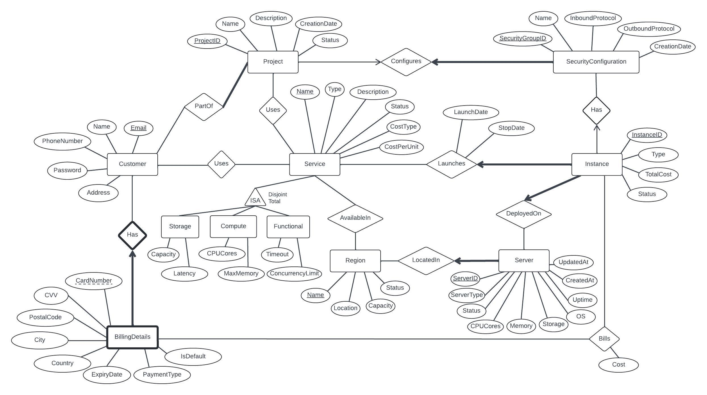

# AAK Cloud Services

## Project Summary
Our project models a cloud service provider, offering customers the ability to create and manage projects. Users can utilize various services, create and manage instances, configure security settings for them and also compute the total costs associated with their cloud service usage.

## ER Diagram

## Project Timeline
We will be dividing up the tasks in 2 sections: Frontend and Backend.

#### Both
1) Deciding the basic layout and colour theme (Deadline 25th July)
2) Error Handling: All the pages should have basic input error handling along with any database errors that arise. (Deadline 1st August)
3) User Notifications: All user actions should have success and failure notifications so user knows if the action went through (Deadline 1st August)

#### Frontend Tasks (Assigned all to Kaz)
1) **Landing Page**: 2 buttons - Login and Sign Up. *Deadline 26th July*
2) **Login Page**: Email and password fields with login button. *Deadline 26th July*
3) **Create Acount**: Name, Email, Phone Number, Password, Address and a Sign Up Button. *Deadline 26th July*
4) **Main Screen**: List of all projects that the customer has with buttons to add/remove projects. *Deadline 27th July*
5) **Create Project Page**: Fields for all project attributes, option to add services and security configuration to the project. *Deadline 27th July*
6) **Project Page**: All Project attributes, list of services being used by the project and list of instances for each service along with option to add/remove any service or associated instance. *Deadline 28th July*
7) **Billing Page**: Fields for all billing details. *Deadline 28th July*

#### Backend Tasks (Assigned to Ashmit and Aditya)
1. **Database Connection**: Establish the Oracle database connection with the backend. *Deadline 28th July*
2. **SQL Initialisation Script**: Write the main SQL script to create all tables and the initial data in the database. *Deadline 28th July*
3. **Initialisation**: Write the logic that initialises the prgram with the SQL initialisation script depending on the state of the prgram. *Deadline 28th July*
4. **Login Page**:  *Deadline 29th July*   
    a. Add User authentication with the values in the database

5. **Create Account Page**:  *Deadline 29th July*  
    a. Add the user details to the database.  

6. **Main Screen**:  *Deadline 30th July*  
    a. Retrieve the current user's list of projects from the database.  
    b. Remove the project from the database if the project is deleted by the customer. Also, stop any running instances associated with the project and calculate the total cost.

7. **Create Project Page**:  *Deadline 30th July*   
    a. Write to the database to create a new project with all the user specified values.  
    b. Add all the services selected by the user to this project.  
    c. Create and add the security configuration to this project.

8. **Project Page**:  *Deadline 31st July*   
    a. Retrieve the current project's attrbutes from the database.  
    b. Retrieve the current project's services and their associated instances from the database.  
    c. Add Service Button: Add the chosen service to the current project in the database.  
    d. Add Instance Button: Add the created instance to the database for the chosen service associated with this project.  
    c. Remove Service Button: Remove the chosen service from the current project in the database. Stop any associated instances and calculate the total cost.
    d. Remove Instance Button: Remove the chosen instance from the current project and calculate the total cost.

9. **Billing Page**: *Deadline 30th July*   
    a. Add the billing details entered by the user to the database.

10. **SQL Query Check**: Check all queries from Milestone 4 rubric have been included in the project implementation. *Deadline 31st July*

11. **Security**: Ensure that basic security practices are used to prevent security attacks mentioned in Milestone 5 like injection attacks and rainbow attacks. *Deadline 1st August*

## Challenges
1.	We are using Java and JavaScript together for the first time, which could lead to integration issues.
2.	This is our first project with separate frontend and backend teams, potentially causing communication problems or blockers.

## Frontend Views
- [Login Page](./Frontend_Views/LoginPage.png)
- [Sign Up Page](./Frontend_Views/SignUpPage.png)
- [Sign Up Billing Page](./Frontend_Views/SignUpBillingPage.png)
- [Project Page Empty](./Frontend_Views/ProjectPageEmpty.png)
- [Project Page Populated](./Frontend_Views/ProjectPagePopulated.png)
- [Create Project](./Frontend_Views/CreateProject.png)
- [Create Instance](./Frontend_Views/CreateInstance.png)
- [Billing Detail Page](./Frontend_Views/BillingDetailPage.png)

### Milestones
- [Milestone 1](./Milestone%201.pdf)
- [Milestone 2](./Milestone%202.pdf)
- [Milestone 3 Cover Page](./Milestone%203%20Cover%20Page.pdf)

#### Group Members:
- Aditya Goel
- Ashmit Gupta
- Kaz Tahara-Edmonds
