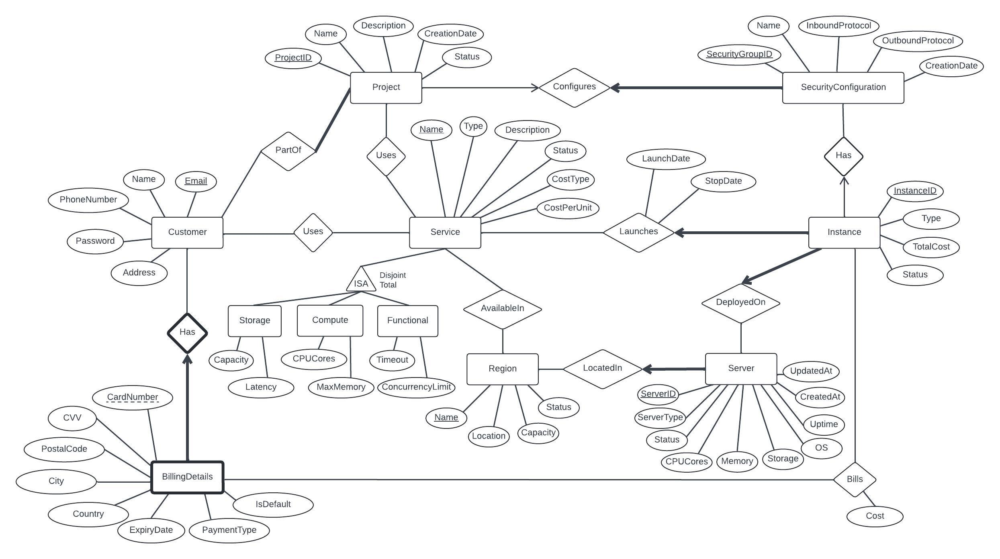

# Aakstra Cloud Services

Aakstra is a cloud service provider developed using Spring Boot, designed to streamline cloud infrastructure management while minimizing database redundancy. It enables customers to create and manage projects, configure services, apply security settings, and track associated costs efficiently. The project integrates advanced error handling, user notifications, and robust security measures to ensure a smooth and secure user experience.

## Get Started

### Prerequisites 
- OracleDB credentials
- Java 21 and Gradle for back-end
- Node.js and npm for the front-end

### Installation
1. Clone the repository
    ```
    git clone https://github.com/agoel25/Aakstra.git
    cd Aakstra
    ```
2. Add your OracleDB credentials to `DatabaseConnectionHandler.java` and `application.properties` files in the backend directory.

3. Navigate to and run the backend:
    ```
    cd backend
    ./gradlew clean build
    ./gradlew bootRun
    ```
4. Navigate to and run the frontend:
    ```
    cd ../frontend
    npm install
    npm run dev
    ```
5. Open `http://localhost:3000` in your browser.


## ER Diagram

This ER diagram represents the database structure, including entities for services, projects, instances, customers, and billing.

